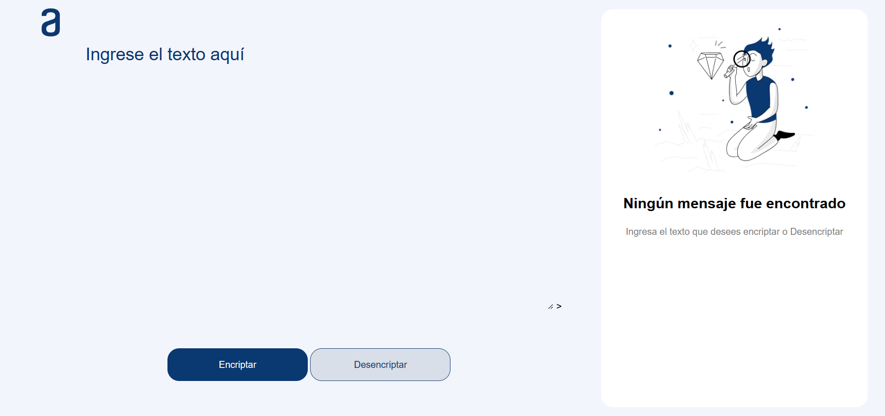

# challengEncriptador

<h3>Descripción del proyecto:</h3>

El presente repositorio contiene un encriptador de texto, en cual podrás encriptar y desencriptar texto, a la vez que podrás copiarlo al portapapeles para colocarlo donde quieras.
## Características

- Encripta y descifra mensajes de forma segura.
- Algoritmo de encriptación avanzado para una mayor protección.
- Interfaz fácil de usar.
- Facilidad de copiado de texto.

## Forma de uso
<ol>
  <li>Introduce el texto en el campo con la leyenda "Ingrese el texto aquí."</li>
    <li>Luego debe presionar en el botón correspondiente (Encriptar o Desencriptar)</li>
  <li>El texto generado se presentará del lado derecho</li>
  <li>Con la generación del nuevo texto aparecera un botó para copiar al porta papeles.</li>
</ol>
